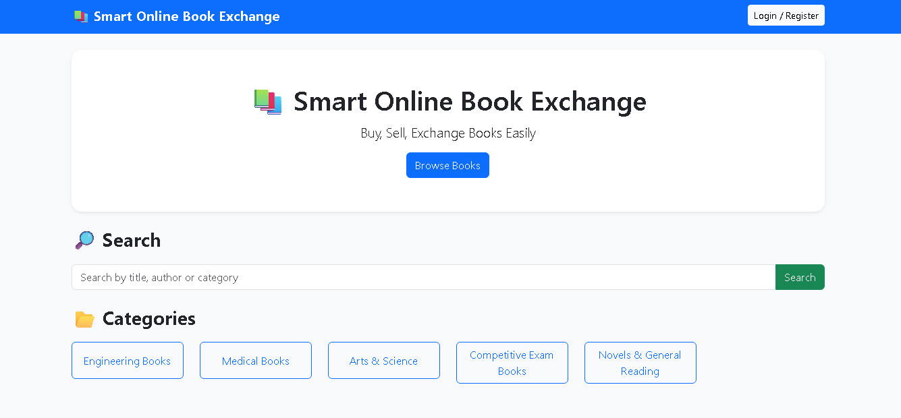
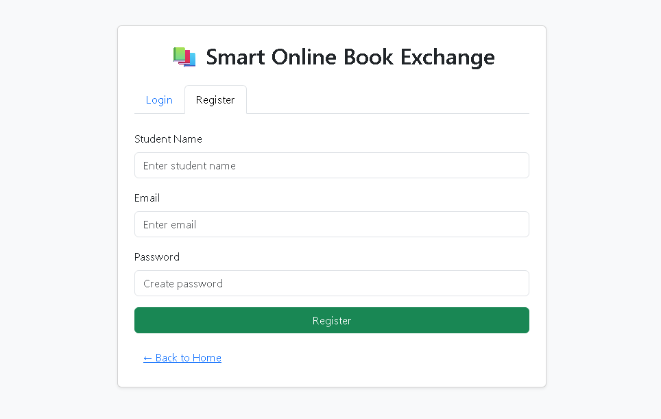
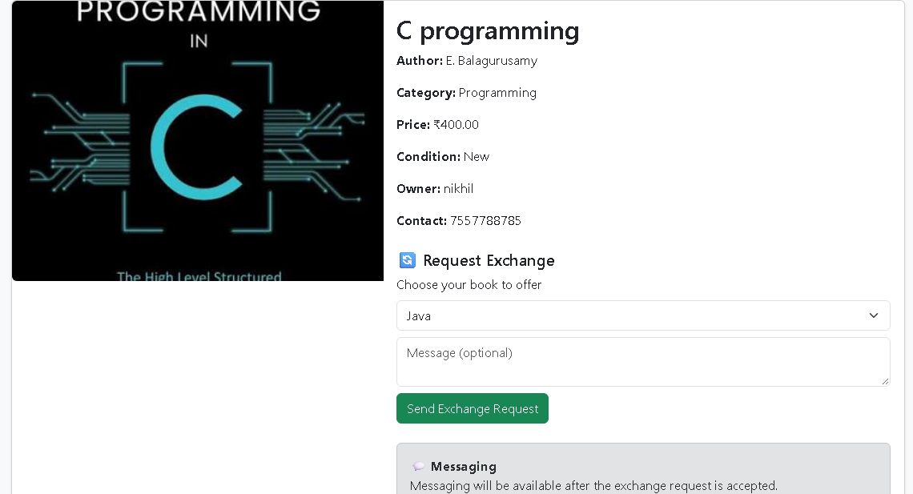
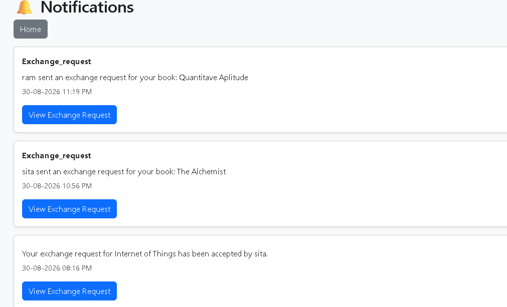
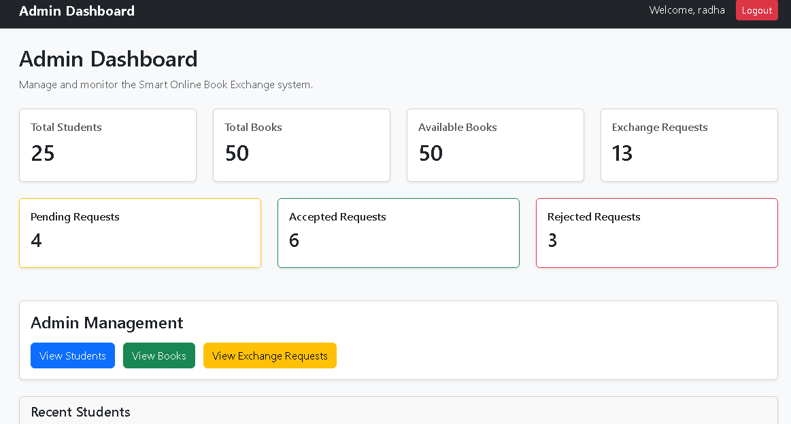

# Smart Online Book Exchange

## Project Overview

Smart Online Book Exchange is a web-based application developed to provide students with an easy platform to exchange and manage books online.

The system allows students to register and log in, upload books, browse and search available books, view book details, send exchange requests, track exchange activities, communicate through messages, and receive notifications.

An administrator can manage students, books, and exchange requests through the admin dashboard.

## Features

### Student Module

- Student registration and login
- Session-based authentication
- Upload books
- Edit and delete uploaded books
- View personal books
- Browse available books
- Search books
- Browse books by category
- View book details
- Send book exchange requests
- View exchange requests
- Track exchange status
- Send and receive messages
- Receive notifications

### Admin Module

- Admin login
- Admin dashboard
- Manage students
- Manage books
- Manage exchange requests
- View and process exchange activities

## Technologies Used

- Frontend: HTML, CSS, JavaScript
- Backend: PHP 8.x
- Database: MySQL
- Server: Apache
- Development Environment: XAMPP
- Database Management: phpMyAdmin

## Database

### Database Name

book_exchange_db

The database stores information related to:

- Students
- Books
- Exchange requests
- Messages
- Notifications
- Reviews

The project also contains the following SQL file:

database_fix.sql

This SQL file can be used during database setup according to the project's database schema.

## Project Structure

Book_exchange/
│
├── admin_dashboard.php
├── admin_login.php
├── admin_logout.php
├── admin_books.php
├── admin_students.php
├── admin_requests.php
│
├── index.php
├── register.php
├── login.php
├── logout.php
├── auth.php
│
├── add_book.php
├── upload_book.php
├── edit_book.php
├── update_book.php
├── delete_book.php
├── save_book.php
├── my_books.php
├── browse_books.php
├── book_details.php
│
├── search_book.php
├── search_books.php
├── book_categories.php
├── category_books.php
│
├── exchange.php
├── exchange_request.php
├── exchange_status.php
├── process_exchange.php
├── my_requests.php
│
├── messages.php
├── send_message.php
│
├── notifications.php
├── notify_user.php
│
├── db_connect.php
├── database_fix.sql
│
├── uploads/
│
├── Book_exchange_screenshots/
│   ├── home.png
│   ├── register.png
│   ├── browse_book.png
│   ├── book_detail.png
│   ├── notification.png
│   └── admin_dashboard.png
│
└── README.md

## Requirements

Before running the project, install:

- XAMPP
- Apache
- MySQL
- PHP 8.x
- Web browser

## How to Run the Project

### 1. Install XAMPP

Install XAMPP with Apache, MySQL, and PHP.

### 2. Copy the Project

Copy the project folder into:

C:\xampp\htdocs\

For example:

C:\xampp\htdocs\Book_exchange\

### 3. Start XAMPP

Open the XAMPP Control Panel and start:

- Apache
- MySQL

Make sure both services are running.

### 4. Create the Database

Open phpMyAdmin:

http://localhost/phpmyadmin/

Create a database named:

book_exchange_db

### 5. Import the Database

Select the book_exchange_db database in phpMyAdmin.

Import the following SQL file:

database_fix.sql

Execute the SQL according to the database setup requirements.

### 6. Check Database Connection

The default database connection is:

Host: localhost
Username: root
Password: empty
Database: book_exchange_db

The database connection is configured in:

db_connect.php

If the MySQL password is different on your system, update the connection settings in db_connect.php.

### 7. Run the Application

Open a web browser and visit:

http://localhost/Book_exchange/

The Smart Online Book Exchange application should now open.

## Student Workflow

Student Registration
        ↓
Student Login
        ↓
Browse / Search Books
        ↓
View Book Details
        ↓
Send Exchange Request
        ↓
Book Owner Responds
        ↓
Exchange Status Updated
        ↓
Notifications / Messages

## Admin Workflow

Admin Login
     ↓
Admin Dashboard
     ↓
Manage Students
     ↓
Manage Books
     ↓
Manage Exchange Requests
     ↓
Process Exchange Activities

## Database Compatibility

The project was updated to match the existing MySQL database schema.

Important database and PHP compatibility corrections include:

- Student name uses the name field.
- Student registration uses a unique email.
- Books use student_id for ownership.
- Books use book_condition for condition information.
- Messages use content and sent_at.
- Notifications use student_id.
- Exchange requests use current_book_id and desired_book_id.
- Uploaded book images use paths stored under the uploads/ directory.

These changes keep the PHP files consistent with the database structure.

## Project Screenshots

### Home Page

### Student Registration

### Browse Books

### Book Details

### Notifications

### Admin Dashboard

## Project Objective

The main objective of this project is to provide students with a convenient online platform for discovering, sharing, and exchanging books.

The system provides a structured way for students to manage books and exchange requests through an online platform.

## Future Enhancements

- Email notifications
- Advanced book recommendation system
- Improved search and filtering
- Real-time chat
- Mobile application
- Enhanced book ratings and reviews
- Improved authentication and security
- Online deployment

## Project Type

Academic / College Project

## Source Code

The complete source code, database SQL file, and project screenshots are available in this repository.

GitHub Repository:

https://github.com/radhika74835/Book_exchange

## Note

This project is designed to run locally using XAMPP, Apache, PHP, and MySQL.

For local execution, the database must be created and configured according to the instructions provided above.
